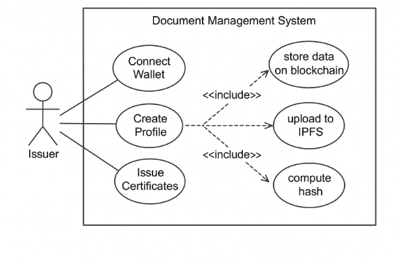
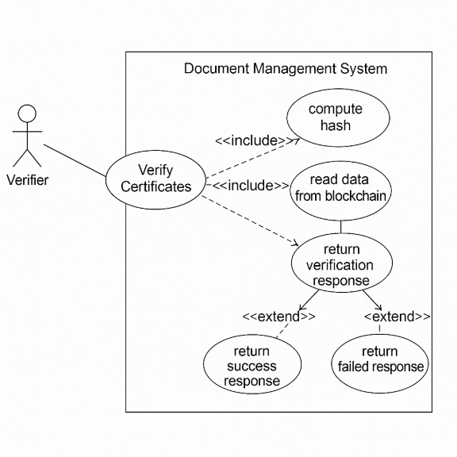
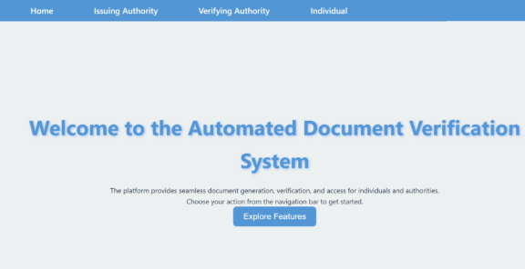
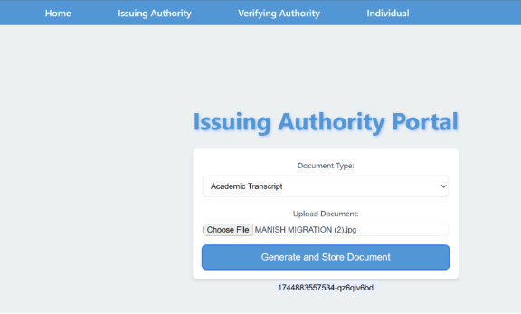
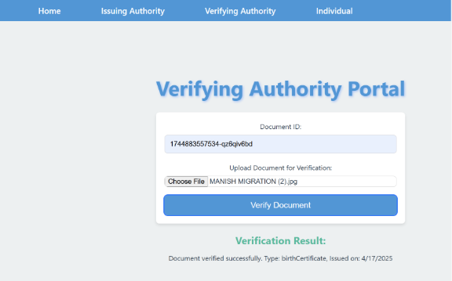
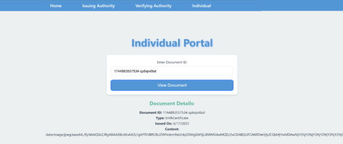
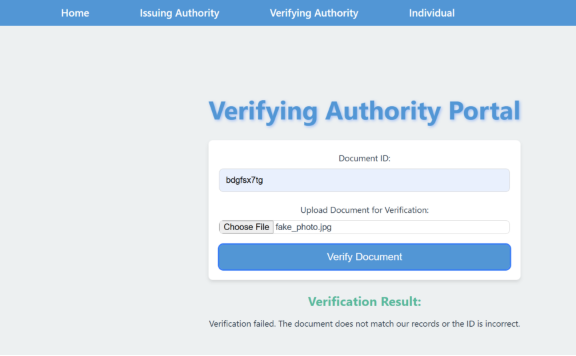

Automated Document Verification - Project Documentation
# **1. Project Title**
Automated Document Verification System
# **2. Introduction**
The Automated Document Verification System is designed to provide a secure, fast, and reliable method for verifying the authenticity of documents using cryptographic hashing techniques. With the rise of document forgery, fake images, and digital tampering, this system offers a streamlined solution for institutions that rely on the trustworthiness of submitted documents. In addition to document verification, the system can also detect fake or manipulated images by analyzing their digital signatures and metadata. The application is built using Node.js for backend operations and React.js (with Vite) for the frontend interface..
# **3. Objective**
The main objective of this project is to create a tool that can:

\- Generate unique cryptographic hashes for uploaded documents.

\- Compare generated hashes with pre-stored values to validate document authenticity.

\- Detect tampering or unauthorized modifications.

\- Offer a clean and intuitive interface for users to interact with.
# **4. Technologies Used**
\- Frontend: React.js (Vite)

\- Backend: Node.js

\- Hashing Library: Crypto module (Node.js native)

\- Styling: Custom CSS

\- Package Manager: npm
# **5. Why Node.js**
Node.js is chosen for its lightweight and asynchronous nature, making it ideal for building fast and scalable server-side applications. The built-in crypto module allows us to generate hashes without the need for external libraries. Additionally, its compatibility with React makes the integration seamless.
# **6. Why Use Hashing**
Hashing provides a unique fingerprint for every document. Even the slightest modification in the file content changes the hash entirely, making it a perfect tool for tamper detection. Unlike encryption, hashes are one-way functions, meaning they cannot be reversed, ensuring data privacy.
# **7. How It Works**
1\. A user uploads a document (PDF, JPG, etc.)

2\. The frontend sends the file to the backend.

3\. The backend processes the file and generates a SHA-256 hash.

4\. This hash is displayed to the user or checked against a known hash for verification.

5\. If the hashes match, the document is verified. Otherwise, it is flagged as tampered.

# **8. Folder Structure Overview**
\- /src: Contains main application logic

\- App.jsx: Main frontend component

\- App.css: Styling for components

\- main.jsx: App entry point

\- backend/: Node.js backend logic (hash generation)

\- package.json: Lists dependencies and scripts

\- package-lock.json: Ensures consistent installs
# **9. Real-World Use Cases**
\- Universities: To verify degree certificates.

\- Employers: To check resumes and employment documents.

\- Banks: To verify submitted identity documents.

\- Government: For authenticating public records like birth or marriage certificates.

\- Fake Images Identification
# **10. Future Scope**
\- Integration with blockchain for immutable hash storage

\- Use of AI to detect document forgery

\- Mobile application for real-time verification

\- Enterprise dashboard and API integration

\- Cloud database for user document management
# **11. Challenges Faced**
\- Ensuring hash generation is consistent across formats

\- Designing a user-friendly yet secure UI

\- Integrating frontend and backend smoothly

\- Handling large document sizes efficiently
# **12. Key Learnings**
\- In-depth understanding of file hashing and SHA algorithms

\- Frontend-backend communication using APIs

\- Creating a secure and responsive web application

\- Optimizing user experience for real-time feedback
# **13. How to Run the Project**
1\. Clone the repository

2\. Navigate to the project folder

3\. Install dependencies using `npm install`

4\. Start backend server with `node server.js` (or your server file)

5\. Start frontend using `npm run dev`

6\. Visit `http://localhost:5173` in browser
# **14. Screenshots**

**HOME PAGE**

**GENERATING AND STORING IMAGES**

**VERIFICATION PORTAL**

**DOCUMENT CHECK PORTAL**

**FAKE IMAGE IDENTIFICATION**

# **15. Conclusion**
The Automated Document Verification system demonstrates how cryptographic principles can be practically applied to solve real-world problems. By combining simplicity in UI with the robustness of hashing algorithms, the project offers a scalable, secure, and efficient solution for document authentication needs across industries.
